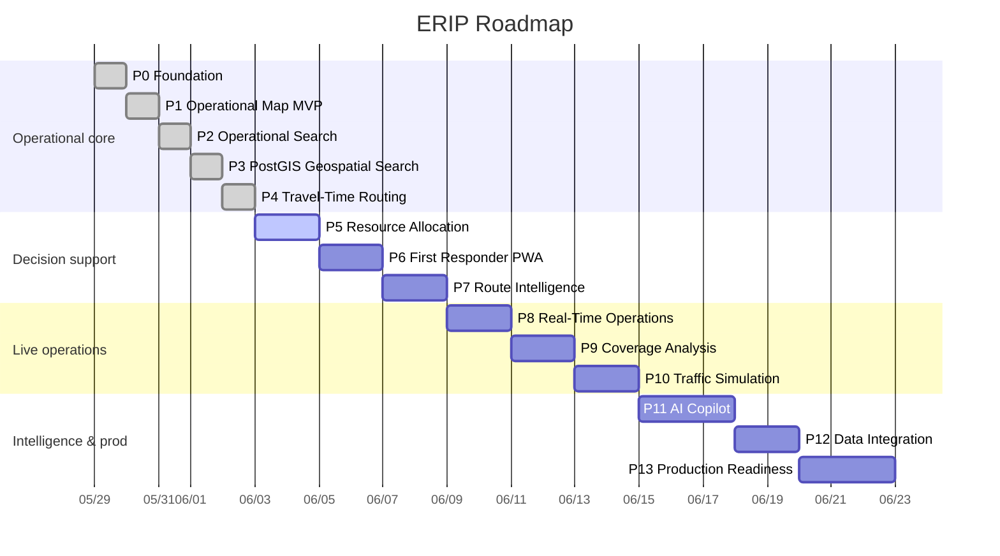

# Emergency Response Intelligence Platform — Roadmap

A multi-agency operational intelligence system combining incidents, responders,
facilities, routing, travel-time analysis, and operational awareness into a
common operating picture.

**Phases are units of work, not calendar days.** This file's job is to show, at
a glance, how far along the phased build is.

---

## Status legend

| ✅ Complete | 🚧 In progress | ⏭️ Next up | ⬜ Not started |
|---|---|---|---|

---

## Progress

```
Phases 0–13:   [███████░░░░░░░░░░░░░]  36%  (5 / 14 complete)
```

**MVP milestone (phases 0–4): complete ✅** — the shareable, Peregrine-aligned
demonstration is done. Last shipped: **Phase 4 — Travel-Time Routing**.

### By phase

| # | Phase | Progress | % | Status |
|---|---|---|---|---|
| 0 | Foundation                        | `██████████` | 100% | ✅ |
| 1 | Operational Map MVP               | `██████████` | 100% | ✅ |
| 2 | Operational Search                | `██████████` | 100% | ✅ |
| 3 | PostGIS Geospatial Search         | `██████████` | 100% | ✅ |
| 4 | Travel-Time Routing & Isochrones  | `██████████` | 100% | ✅ |
| 5 | Resource Allocation               | `░░░░░░░░░░` |   0% | ⏭️ |
| 6 | First Responder PWA               | `░░░░░░░░░░` |   0% | ⬜ |
| 7 | Route Intelligence                | `░░░░░░░░░░` |   0% | ⬜ |
| 8 | Real-Time Operations              | `░░░░░░░░░░` |   0% | ⬜ |
| 9 | Coverage Analysis                 | `░░░░░░░░░░` |   0% | ⬜ |
| 10 | Traffic Simulation               | `░░░░░░░░░░` |   0% | ⬜ |
| 11 | AI Copilot                       | `░░░░░░░░░░` |   0% | ⬜ |
| 12 | Data Integration                 | `░░░░░░░░░░` |   0% | ⬜ |
| 13 | Production Readiness             | `░░░░░░░░░░` |   0% | ⬜ |

### Timeline

GitHub renders this Mermaid block inline.



---

## Phases at a glance

| # | Phase | Status | Primary deliverable |
|---|---|---|---|
| 0 | Foundation | ✅ | Monorepo · NestJS API · React + Vite web · Docker Compose · Postgres · seed data |
| 1 | Operational Map MVP | ✅ | Leaflet command center · incidents/resources/facilities layers · filters · legend · details panel |
| 2 | Operational Search | ✅ | `GET /search` grouped + ranked across entities · search panel · map fly-to |
| 3 | PostGIS Geospatial Search | ✅ | PostGIS data layer · `ST_DWithin`/`ST_Distance` nearby endpoints · nearest-units panel · RDS-ready |
| 4 | Travel-Time Routing & Isochrones | ✅ | Valhalla `/routing/route` + `/routing/isochrone` · polyline decoder · straight-line fallback · on-map routes + ETA |
| 5 | Resource Allocation | ⏭️ | `/dispatch/recommendations` · allocation scoring (travel-time + availability + coverage impact) |
| 6 | First Responder PWA | ⬜ | `/responder` view · assignment card · route map · ETA · current location · installable PWA |
| 7 | Route Intelligence | ⬜ | Multi-stop routing · alternatives · traffic-aware costing · reachability |
| 8 | Real-Time Operations | ⬜ | WebSockets · live unit positions · incident + dispatch state updates |
| 9 | Coverage Analysis | ⬜ | Isochrone-based coverage maps · gap detection · demand vs. coverage |
| 10 | Traffic Simulation | ⬜ | `/simulation/tick` + `/reset` · moving units · scenario playback |
| 11 | AI Copilot | ⬜ | Natural-language operational queries · situation summaries · approval-gated suggestions |
| 12 | Data Integration | ⬜ | External feed ingestion · CAD/AVL adapters · data normalization |
| 13 | Production Readiness | ⬜ | Kubernetes/k3s · observability · auth · CI/CD · hardening |

---

## MVP target

Phases 0–4 — **complete ✅**. This is the shareable Peregrine-aligned demonstration.
